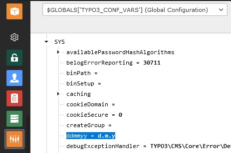

.. include:: ../Includes.txt

.. _user_manual:

============
User manual
============

Event recurrence
================

Event recurrences might be flexibly defined according
`RFC 5545 <https://www.ietf.org/rfc/rfc5545.txt>`__ by activating the enable
switch:

   Define event recurrences in the "Recurrence"-tab

For the *Rule* field most used patterns can be selected by the dropdown box.
To further refine it pattern generator might be used (e.g. from
`textmagic.com <https://www.textmagic.com/free-tools/rrule-generator>`__).

Selected dates can be listed in the *Dates* field. Add one date per line and
make sure the format is according to the configuration defined by
`$GLOBALS['TYPO3_CONF_VARS']['SYS']['ddmmyy']`. It can be looked up in the
configuration module:

   Date format definition in configuration module

The meaning from the letters can be found at
`php.net <https://www.php.net/manual/en/datetime.format.php>`__.

The *Exception dates* field allows to specify which dates from the set defined
by the *Rule* field should be excluded.

The *Set* field is for advanced users.

.. note::

   The maximum time period events should be shown for is defined by the TS
   constant `displayDays`.

Related documentation
---------------------

-  `RFC 5545 <https://www.ietf.org/rfc/rfc5545.txt>`__
-  `RFC 2445 <https://www.ietf.org/rfc/rfc2445.txt>`__
-  `RRule by kanzaki.com <https://www.kanzaki.com/docs/ical/rrule.html>`__
-  `rlanvin/php-rrule <https://github.com/rlanvin/php-rrule>`__

