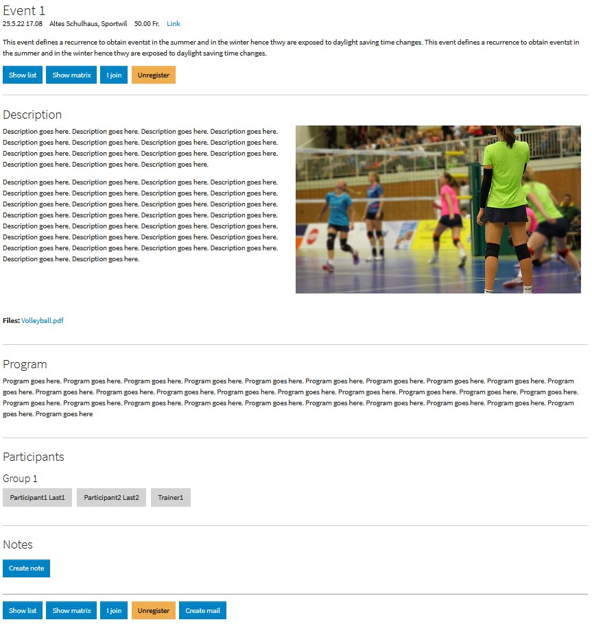

.. image:: https://img.shields.io/badge/TYPO3-11-orange.svg
   :alt: TYPO3 11
   :target: https://get.typo3.org/version/11

.. image:: https://img.shields.io/badge/TYPO3-10-orange.svg
   :alt: TYPO3 10
   :target: https://get.typo3.org/version/10

.. image:: https://github.com/buepro/typo3-grevman/workflows/CI/badge.svg
   :alt: Continuous Integration Status
   :target: https://github.com/buepro/typo3-grevman/actions?query=workflow%3ACI

===========================
TYPO3 extension ``grevman``
===========================

The extension allows to manage group events typically used in sport clubs
where groups of members take part in events. Members might have different
roles such as leader or participant. Roles are defined by frontend groups (not
to be confused with member groups).

Events are managed by an administrator in the backend where event recurrences
can easily be set up.

Group members can register them self through the web site to participate on
events.

Events and their participants can be presented in a table where one can
easily see who registered for an event.

Members with a leading role might send notifications to event
participants by email.

:Repository:  https://github.com/buepro/typo3-grevman
:Read online: https://docs.typo3.org/p/buepro/typo3-grevman/main/en-us/
:TER:         https://extensions.typo3.org/extension/grevman

Screenshots
===========

Table view
----------

.. figure:: Documentation/Images/TableView.jpg
   :alt: Table view from events

List view
---------

Detail view
-----------

Acknowledgement
===============

This extension has been sponsored by `SAC-Sektion Uto <https://www.sac-uto.ch>`__.

