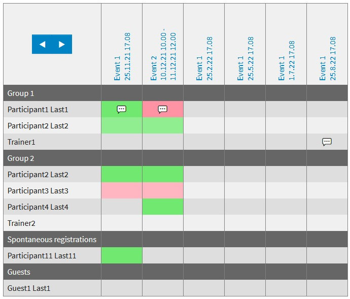

=========================
TYPO3 extension `grevman`
=========================

The extension allows managing group events typically used in sport clubs
where groups of members take part in events. Members might have different
roles such as leader or participant. Roles are defined by frontend groups (not
to be confused with member groups).

Events are managed by an administrator in the backend.

Group members can register them self through the web site to participate on
events.

Events and their participants can be presented in a matrix where one can
easily see who registered for an event.

Members with a leading role might send notifications to event
participants by email.

Screenshots
===========

Matrix view
-----------

List view
---------

.. figure:: Documentation/Images/ListView.jpg
   :alt: List view from events

Detail view
-----------

.. figure:: Documentation/Images/DetailView.jpg
   :alt: Detail view from events

Acknowledgement
===============

This extension has been sponsored by `SAC-Sektion Uto <https://www.sac-uto.ch>`__.

Code quality
============

.. image:: https://github.com/buepro/typo3-grevman/workflows/CI/badge.svg
   :alt: Continuous Integration Status
   :target: https://github.com/buepro/typo3-grevman/actions?query=workflow%3ACI

Documentation
=============

Head over to `docs.typo3.org <https://docs.typo3.org/p/buepro/typo3-grevman/master/en-us/>`__.
